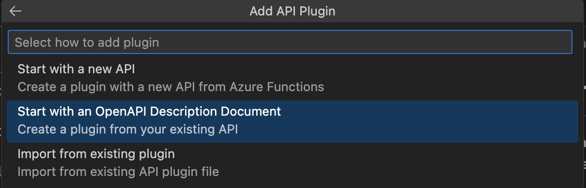

# Random-User-Declarative-Agent-
Sample Declarative Agent for Microsoft 365 Copilot using the public random user generator API at https://randomuser.me/.

## Planning the Agent
I am member of the Microsoft Copilot team working on the Declarative Agent platform and I created this sample app to explore and test building an agent that retrieves data from external APIs (also known as actions). My first step was finding a suitable API. At [Apipheny](https://apipheny.io/free-api/), a site offering a collection of free public APIs, I discovered a random user data generator [randomuser.me](https://randomuser.me)). This open-source API provides details about a fictional user, including gender, name, email, and address—a “Lorem Ipsum” for user data.


## Build the Open API Specification File
The creators of random user don't provide an Open API specificication file but you can use Copilot to generateing one from the availalbe documenation. Try this prompt:

```
Can you create an open API specification from this web page https://randomuser.me/documentation
```


Next ask Copilot to save it as a YAML file


## Build the Declaritive Agent Using the Teams Toolkit and Visual Studio Code


